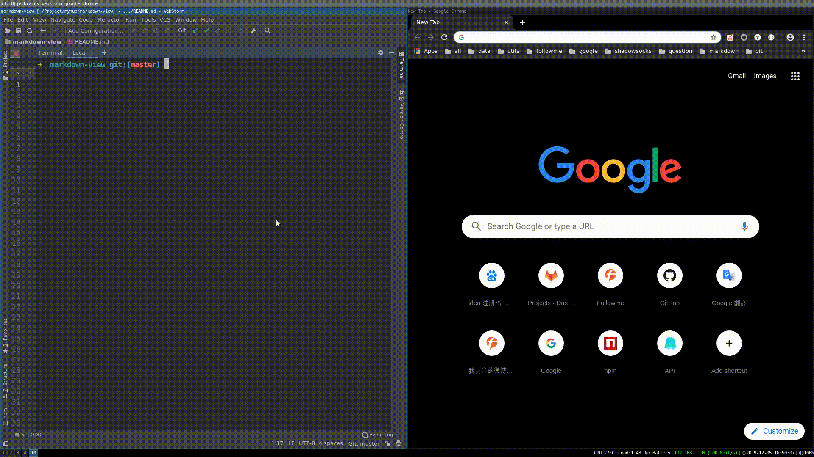

## Markdown view

markdown文件浏览器实时预览

### Install

```bash
   npm install -g markdown-view
```

### Usage

```bash
   markdown-view <filename>
```

### Options

```bash
   -V, --version      output the version number
   -p, --port <port>  server port (defaults to random)
   -h, --help         output usage information
```

### Demo

```bash
   markdown-view ./README.md
   
   markdown-view -p 8000 ./README.md
```



### releases

|  版本  |  更新说明 | 日期 |
| :----- |:---------|:----|
| v1.0.1 | 版本发布| 2019-03-29 |
| v1.0.2 | 修复文件监听,浏览打开bug | 2019-04-16 |
| v1.0.3 | 修复监听,title乱码bug.优化随机获取端口代码 | 2019-05-13 |
| v1.0.4 | 优化,将127.0.0.1改成本机IP地址 | 2019-05-23 |
| v1.1.0 | 更新open方式 | 2019-05-28 |
| v1.1.1 | 增加指定端口参数 | 2019-07-04 |
| v1.1.2 | 增加使用描述 | 2019-12-05 |
